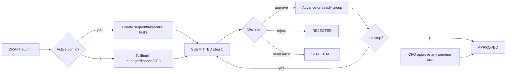
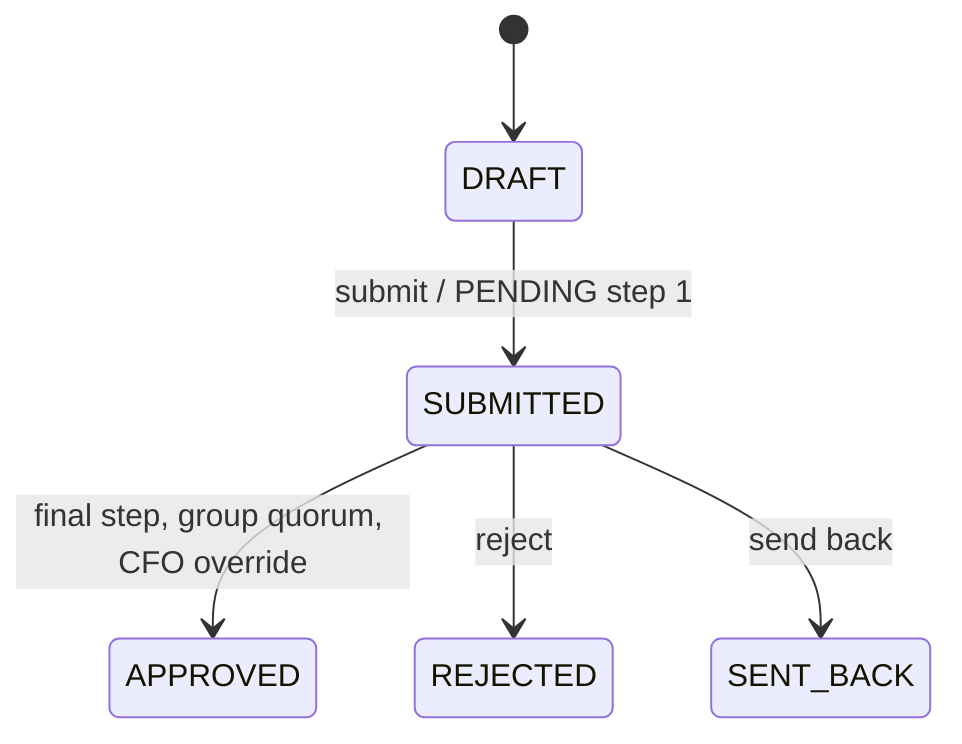

# Approval engine analysis

## Configuration and execution

At submission the active company `ApprovalWorkflowConfig` is read and its steps are materialised as Approval records. The config/version is not immutably attached to the Expense; only generated records and a limited approval snapshot remain. A save deactivates all existing tenant configurations, then creates a new active configuration.

Sequential: use employee manager if MANAGER is configured; otherwise first active user in listed roles (normally `roles[0]`). Parallel: shared group ID, employee manager if included, plus every active user in other configured roles. A missing assignee silently removes that effective step. All due dates are now + 2 calendar days; no escalation worker exists.

## Rules

| Rule | Completion | Effect |
|---|---|---|
| ALL | all tasks APPROVED | cancel pending group tasks, advance/finalise |
| PERCENTAGE | approved / total >= percentage; absent/zero defaults 1 | same; fractional result is not rounded |
| ANY | approved >= required_approvals (default 1) | same; can require more than one despite label |

Before quorum, history is appended but current step does not change. A reject/send-back by one eligible member ends the whole group/workflow. Future tasks are created early but queue visibility requires `task.step == expense.current_step`; direct task action does not enforce this visibility condition.

## Eligibility, override, and states

Actor must be direct assignee, same role on an unassigned task, or CFO. No tenant check is made. CFO approval of *any* pending task marks it approved, sets every other pending task SENT_BACK, and finalises Expense APPROVED—bypassing step, quorum, task role and configuration. `override_rules.cfo_override` is stored/UI-editable but never read, so override is always enabled.

Send-back is persisted as SENT_BACK, not DRAFT despite comments. Update/submit accept only DRAFT; resubmission is unavailable.

## Fallback workflow

Manager (direct or first active) is first. Finance is added if base amount >10,000, violations exist, or no prior task. CFO (else unsupported SENIOR) is added if >50,000, risk >0.7, or no prior task. Finally Admin is fallback. Last materialised task is final. Thus clean low-value expenses with a manager are manager-only.

## Spring reimplementation requirements

Use transactions and locking/optimistic versions. Persist workflow version/full snapshot at submission. Validate assignments and quorum before state changes. Add CANCELLED rather than overloading SENT_BACK, record actor IDs in history, require tenant/current-step/active-account checks, honor override configuration, and implement explicit resubmission.