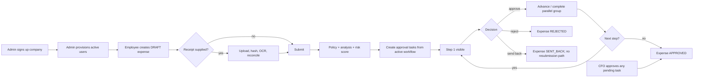

# ClaimSync system overview

## Purpose

ClaimSync is a multi-tenant expense-reimbursement application. An organisation administrator creates a company, provisions users, configures category policies and an approval workflow, and employees submit individual expenses with optional receipt evidence. The system converts costs to a global base currency, runs OCR and risk checks, then routes each submitted expense through approval tasks.

The operational source of truth is the root `backend/` (Express/Mongoose) and `frontend/` (React/Vite) projects. `claimsync/` is an untracked duplicate of those projects plus a bare Spring Boot 4.1/Java 17 starter; it contains no migrated business implementation.

## Major modules

| Module | Responsibility |
|---|---|
| Auth and users | Company/admin registration, bcrypt password authentication, JWT session identity, tenant user provisioning/deletion. |
| Company and policy | Company metadata/base currency; per-category amount and receipt policy. |
| Expenses | Draft, edit, receipt declaration, currency conversion, submit, version snapshots and employee list. |
| Receipts/OCR | Disk upload, SHA-256 duplicate detection, immediate/mock queued OCR, field parsing and reconciliation. |
| Approval engine | Materialises workflow steps into approval tasks; executes sequential/parallel decisions, rejection/send-back and CFO force approval. |
| Workflow configuration | Stores one active tenant workflow, sequential/parallel steps and group rules. |
| Audit/idempotency | Append-only event records and optional 24-hour replay records for writes. |
| Frontend | Role-oriented dashboards, forms and queues; several dashboard/report/analytics screens are display-only placeholders. |

## Roles

`ADMIN`, `EMPLOYEE`, `MANAGER`, `FINANCE`, and `CFO` are the active user roles. `SENIOR`, `HR`, and `LEGAL` are allowed only in workflow configuration/task schemas; they cannot be created through the user API and are not frontend session roles. `CFO` has a code-level override independent of configured `override_rules`.

## End-to-end expense workflow

## Core business processes

1. **Tenant bootstrap:** public signup creates `Company`, then active verified ADMIN; JWT contains `user_id`, role and `company_id`.
2. **User onboarding:** an admin creates a user with a generated 12-character temporary password and emails it. Contrary to the UI/README, this path does not create an `Invite` or require first-login password change.
3. **Expense lifecycle:** an authenticated caller can create and edit a DRAFT (ownership is not enforced), then submit it once. Submission evaluates policy/risk and creates all future approval records at once.
4. **Receipt handling:** the file is stored locally, deduplicated globally by SHA-256, processed synchronously by default, then OCR results can overwrite selected draft fields/flags through reconciliation.
5. **Approval:** pending records are visible only when their step equals `Expense.current_step`. Parallel records share a group and close according to ALL, PERCENTAGE, or ANY. A rejection or send-back cancels remaining pending records by changing them to `SENT_BACK`.

## Important implementation reality

There is no Report schema/API despite report UI. There are no REST endpoints for password reset, analytics, currencies, audit trails, expense retrieval by id, resubmission, notification, or status changes. All business operations are non-transactional MongoDB writes; failure between writes can leave partial workflow state.
